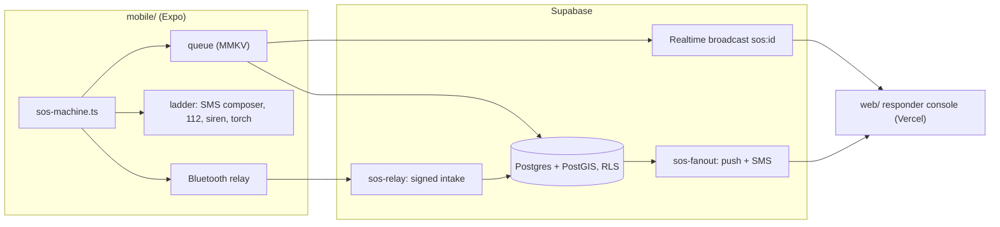

# Todu

[](https://github.com/kandulanikhilvarma/to-do/actions/workflows/ci.yml)
[](LICENSE)
[](https://todu-kandula.vercel.app)

**Help is one tap away.** A personal emergency SOS and safety app for India,
plus its companion website and responder console.

> Todu is not a substitute for emergency services. In an emergency, call 112.
> Offline features are best effort and depend on your device, your network and
> nearby users.

Live preview: https://todu-kandula.vercel.app

## What is here

| Path | What it is | Verified by |
|---|---|---|
| `web/` | Next.js site in English, Telugu and Hindi, plus the responder console (phone sign-in, live pings, ETA sharing). Deployed to Vercel. | `tsc`, `eslint`, `next build` |
| `mobile/` | Expo SDK 57 app: SOS state machine, cancel and duress PINs, offline queue, fallback ladder, siren and torch, live trail, Bluetooth relay, invites, push, three languages. | `tsc`, `expo lint`, `expo-doctor`, 30 unit tests, Android bundle + prebuild |
| `supabase/` | Postgres + PostGIS schema and RLS, invites, `sos-fanout` (push + SMS) and `sos-relay` Edge Functions. | 23 RLS tests on real Postgres, 15 fan-out and relay tests, `deno check` |
| `docs/` | Architecture, offline ladder, permissions, threat model, source spec. | |

## Architecture



Full component map, state machine and data model: [docs/ARCHITECTURE.md](docs/ARCHITECTURE.md).

## Run it

```bash
git clone https://github.com/kandulanikhilvarma/to-do.git && cd to-do
cd web      && npm install && npm run dev     # http://localhost:3000
cd mobile   && npm install && npx expo start  # needs a development build
cd mobile   && npm run check                  # state machine, PINs, phone, queue
cd supabase && npm install && npm test        # RLS as owner, responder, stranger
```

Neither app needs credentials to run. Without Supabase the console shows
labelled demo data, and the phone still runs every offline rung: SMS composer,
112 and the siren. Copy `web/.env.example` and `mobile/.env.example` to connect
a real project, then apply `supabase/migrations/` in order.

The mobile app uses native modules (MMKV, background location, secure store),
so it runs in a development build, not Expo Go: `npx eas-cli build --profile development`.

## The ethical constraint

The SOS path -- trigger, location broadcast, contact alert, 112 dial, beacon --
is free forever for everyone. Paid tiers cover convenience and depth only.

## Server setup

Everything below is optional; the phone runs every offline rung without it.

```bash
supabase link --project-ref <ref>
supabase db push                                  # migrations 0001-0006
supabase functions deploy sos-fanout sos-relay
supabase secrets set TODU_CONSOLE_URL=https://todu-kandula.vercel.app/dashboard   MSG91_AUTH_KEY=... MSG91_SOS_TEMPLATE_ID=... MSG91_SAFE_TEMPLATE_ID=...   MSG91_NAME_VAR=name MSG91_LINK_VAR=link          # names as in your DLT templates
```

For the database to request fan-out on its own, store `project_url` and
`service_role_key` in Vault (Dashboard > Vault). Without them the trigger is a
no-op and the app requests fan-out itself; either way it sends once.

Push needs an EAS project id (`npx eas-cli init`) so phones can get Expo push
tokens. Bluetooth relay needs a Bridgefy licence key in
`EXPO_PUBLIC_BRIDGEFY_API_KEY`. MSG91 SMS needs TRAI DLT registration of the
sender and both templates; until then SMS is logged as skipped, never as sent.

## Known gaps

Stated plainly, because a safety app that oversells itself gets someone hurt:

- **No voice calls.** MSG91 does not publish its voice API, and a guessed
  request would fail silently in an emergency. Push and SMS are built.
- **Run on an emulator, not a phone.** A release build (x86_64) installs and
  launches on an Android 16 Pixel 6 emulator with no crash or JS error. It has
  not run on a physical device, so GPS, SMS, calls, torch and Bluetooth are
  untested on hardware. The Stage 0 gate in `docs/PERMISSIONS.md` (24 hours of
  background location on MIUI and ColorOS) is still open. Building on Windows
  needs `plugins/with-short-object-paths.js`: gesture-handler's codegen
  otherwise produces a C++ object path over the 260-character limit.
- **Bluetooth relay and torch are built, not field tested.** The relay needs a
  Bridgefy licence and a second Todu phone within about 100 m; the torch relies
  on a hidden camera view and reports itself only once the camera is ready.
- **Edge Functions are typechecked and their cores unit tested against the
  documented Expo and MSG91 formats, but not yet deployed to a live project.**
- **Legal pages are drafts,** English only, and say so on the page.
- **Satellite SOS and silent SMS** are not buildable by any third party. See
  `docs/OFFLINE.md`.

## Deviations from the source specification

- The spec targets **Expo SDK 54**; `mobile/` uses the current **SDK 57**.
- Styling uses plain `StyleSheet` with shared tokens in `mobile/lib/theme.ts`
  rather than Unistyles or NativeWind.
- `nearby_responders()` was removed: it could not work under RLS. Nearby
  dispatch (Stage 3) needs an explicit, opt-in presence table.

## Licence

Apache-2.0. Chosen over MIT for its explicit patent grant and its warranty and
liability disclaimers, which matter for a safety application.

---

[LinkedIn](https://www.linkedin.com/in/nikhilvarmakandula) · [Email](mailto:kandulanikhilvarma@gmail.com) · [Portfolio](https://kandula.studio)
