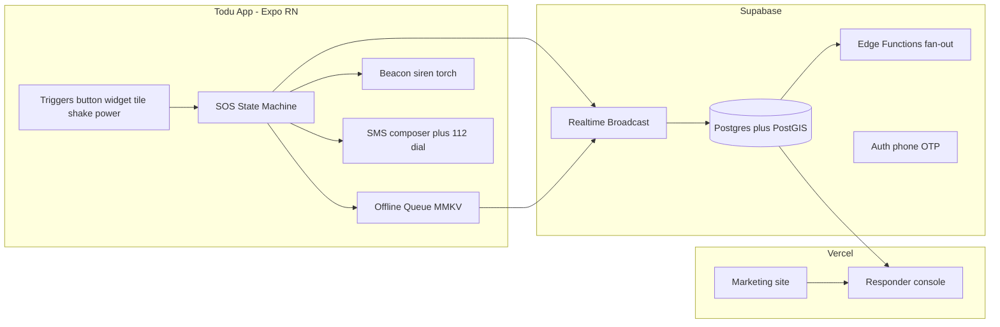
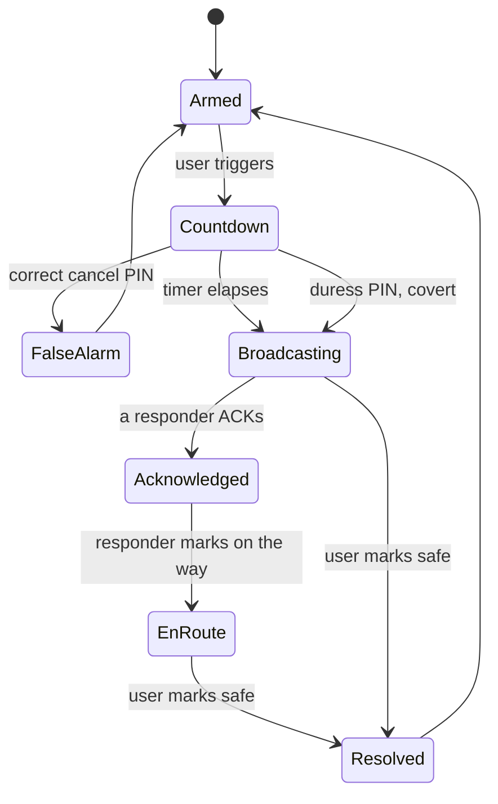
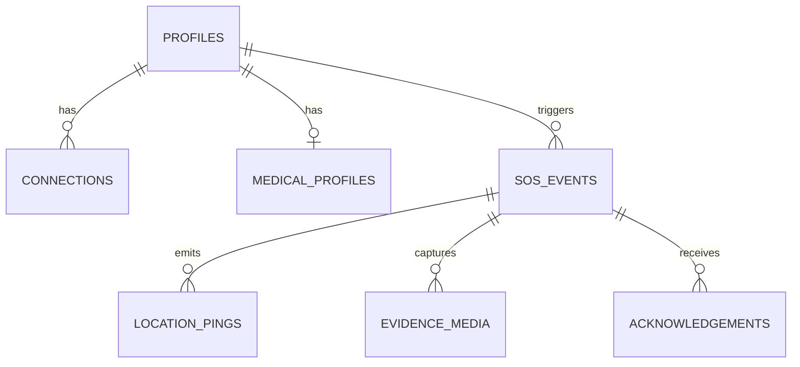

# Architecture

## Components

## Where the logic lives

| Concern | File |
|---|---|
| SOS lifecycle | `mobile/lib/sos-machine.ts` (pure, unit tested) |
| Effects dispatcher, SOS screen | `mobile/app/index.tsx` |
| Fallback ladder | `mobile/lib/ladder.ts` |
| Siren and vibration | `mobile/lib/beacon.ts` |
| Store and forward | `mobile/lib/queue-core.ts` (tested), `mobile/lib/queue.ts` |
| Live location trail | `mobile/lib/tracking.ts`, registered in `mobile/index.ts` |
| Server calls, OTP sign-in | `mobile/lib/backend.ts` |
| PIN rules, phone parsing | `mobile/lib/pin-rules.ts`, `mobile/lib/phone.ts` (tested) |
| Row level security | `supabase/migrations/0003_rls.sql`, `0005_security_fixes.sql` (tested) |
| Responder read model | `supabase/migrations/0004_responder_view.sql` |
| Console UI | `web/components/console.tsx` |
| Web data access | `web/lib/data.ts` |

## State machine

Two rules the tests pin down:

- A **wrong** PIN does not stand the alert down. Only the exact cancel PIN
  cancels; a panicked wrong guess must never silence an emergency.
- The **duress** PIN renders a convincing cancel while escalating covertly.
  The `covert` flag rides on the context so the UI can lie and the ladder cannot.

## Data model

Row level security is the enforcement boundary, not the application. An event
is readable by its owner and by profiles with an **active** connection to that
owner, expressed once in `is_connected_to()` and reused by every policy.

Live location uses Realtime **Broadcast**, not `postgres_changes`: pings arrive
several times a minute per active event and must not go through the WAL.
`location_pings` is the durable trail for the post-incident timeline.
