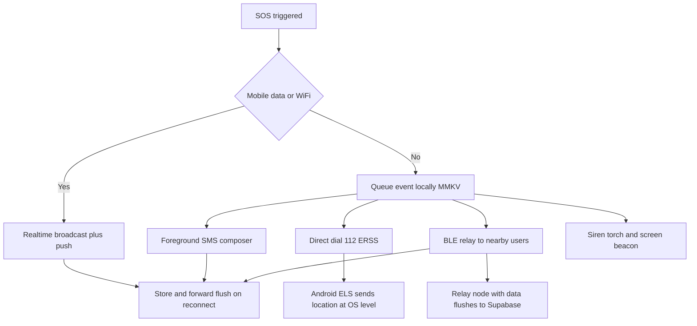

# The offline core

Most safety apps fail silently without data. Todu degrades in a fixed order and
reports which rung actually delivered.

## Feasibility, stated plainly

| Rung | Android | iOS | Shipped |
|---|---|---|---|
| Realtime broadcast | Yes | Yes | Yes |
| SMS to contacts | Composer only; `SEND_SMS` gated to default handlers | Composer only, never programmatic | Yes, always one tap |
| Direct dial 112 | Yes | Yes | Yes |
| Android ELS | Automatic at OS level | N/A | Relied on, not integrated |
| BLE relay | Possible with a foreground service | Background BLE restricted | **No** - licensed SDK not wired |
| Siren, torch, screen | Yes | Yes | Yes |
| Satellite SOS | No third party SDK | No third party SDK | **Never** |

## Why the SMS rung always needs a tap

iOS has no programmatic SMS API; `MFMessageComposeViewController` requires a
user tap and cannot be automated. On Android, `SEND_SMS` is restricted by Google
Play to default SMS handlers, so a safety app that is not the default handler
should expect rejection. `mobile/app.json` therefore does not declare it.

This kills the "zero-tap SMS in the background" idea on both platforms. The
honest design is a pre-filled composer, and saying so in the interface.

## The queue

`mobile/lib/queue.ts` writes to MMKV **synchronously** before the UI advances.
This ordering is deliberate: an SOS must be durably recorded before anything
awaits a network that a dying battery may never resolve. Failed items stay
queued with an incremented attempt count and an exponential backoff capped at
30 seconds; a local copy is always retained for the post-incident timeline.

A corrupt queue is dropped rather than thrown: a parse error must never brick
the SOS path.
