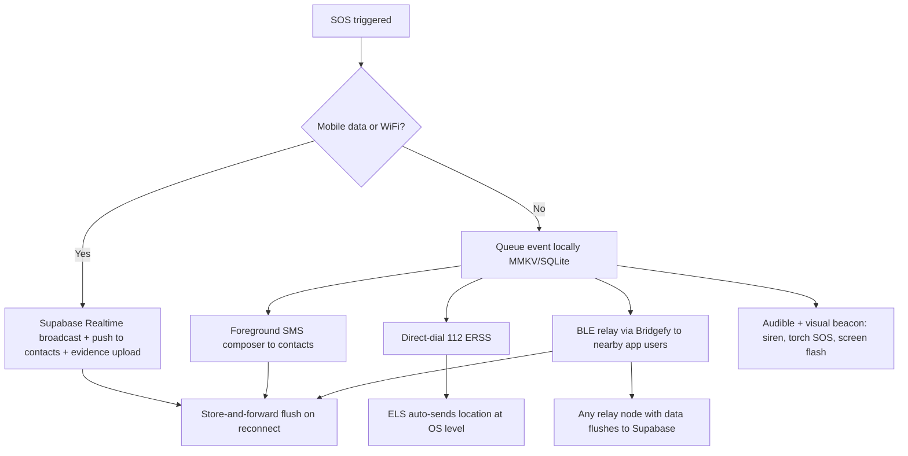
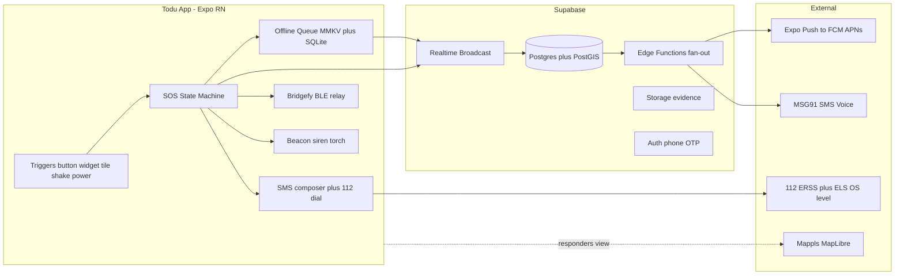
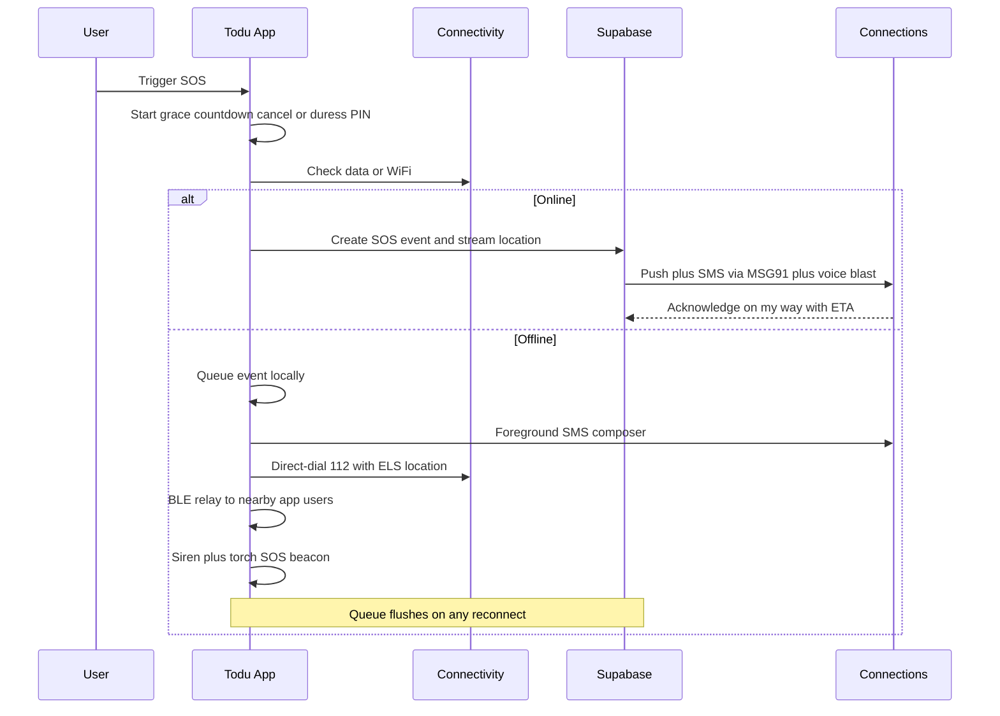
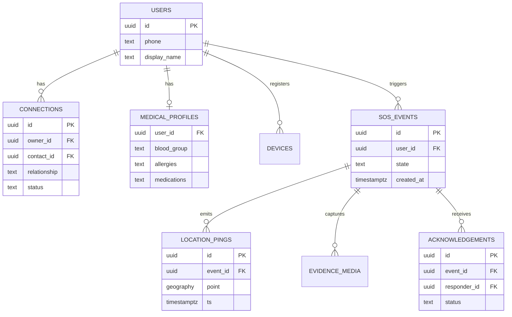
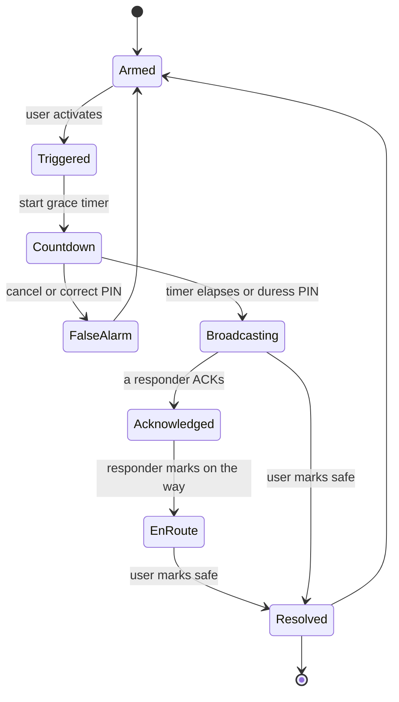
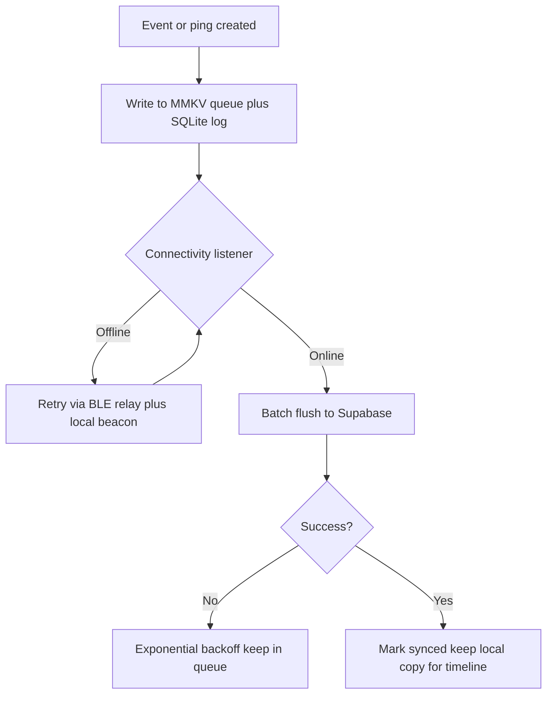

# Build-Ready Specification: "Todu" — Personal Emergency SOS & Safety App + Companion Website

## TL;DR
- **Build it as an Expo (SDK 54) development build, not managed Expo Go** — the offline SOS core requires native modules (SMS intent, BLE, foreground services, widgets, quick-settings tile) that managed Expo Go cannot run. Backend on Supabase (Postgres + PostGIS + Realtime + Edge Functions). India SMS via MSG91 with TRAI DLT registration. This is buildable by a solo dev EXCEPT satellite (not integrable), true silent/background SMS on iOS (impossible), and 24/7 human dispatch (needs a partner).
- **The offline promise must be honestly tiered.** The realistic 2026 fallback ladder a solo dev can ship is: mobile data → foreground SMS composer to contacts + direct-dial 112 → BLE peer relay (Bridgefy SDK, ~100 m/330 ft per hop, best-effort) → audible/visual beacon (siren + torch SOS). Satellite SOS in India is NOT third-party-integrable and barely available; treat the phone's built-in Apple/Google satellite SOS as a documented adjacent capability, not a feature you build.
- **The single biggest engineering risk is not code — it's the OEM battery-killers** (Xiaomi/Realme/Oppo/Vivo dominate India) and **app-store permission approval** (Google Play's SMS policy will very likely reject a non-default-handler SMS app; iOS cannot send SMS silently). Design around these from day one with an OEM autostart wizard and an intent-based SMS composer fallback.

---

## Key Findings

1. **India-first is the right call but reshapes the architecture.** India has a mature government emergency backbone — 112 ERSS, the Nirbhaya panic-button mandate, and Google's Emergency Location Service (ELS), which went live in India on 23 December 2025 (Uttar Pradesh first, integrated by UP Police with Pert Telecom Solutions/PertSol; pilot testing supported over 20 million calls and SMS messages, ~50 m accuracy, Android 6.0+). You should hook into this backbone rather than reinvent it. The DPDP Act 2023 + DPDP Rules 2025 (notified via Gazette G.S.R. 846(E); most legal trackers cite 13 November 2025, though several — PIB, Lexology — cite 14 November 2025; reconcile the exact date at build time) now govern location, audio, and medical data on a phased ~18-month compliance runway.
2. **"All permissions granted easily, no blocks" is impossible as literally stated** and would get the app rejected. Android 14/15/16 and iOS 18/19 deliberately gate background location, background mic, and SMS. The winning strategy is staged, primed, just-in-time permission requests plus an OEM autostart wizard — not a wall of upfront prompts.
3. **Supabase is a good fit** for Realtime location broadcast, PostGIS nearby-responder queries, phone-OTP auth, and Edge Function fan-out — with the caveat to use Realtime **Broadcast** (not Postgres-changes) for high-frequency location pings.
4. **The name "Todu"** (Telugu for companion/support) is the recommended primary — the only shortlisted candidate with no existing safety-app conflict AND cross-lingual resonance for the Telugu-first strategy.

---

## 1. Feature Research: The Superset

I studied Apple Emergency SOS / Crash Detection / Satellite SOS, Google Personal Safety + ELS, Life360, Noonlight, bSafe, Citizen, Flare/SafeTrek, Kitestring, Garmin inReach/Zoleo/Bivy, and India-specific Himmat (Delhi Police), 112 India/ERSS, Raksha, SafetiPin, Shake2Safety, plus bystander apps PulsePoint/GoodSAM.

**What the leaders actually do:**
- **Life360**: Circles, real-time location, SOS button with a 10-second countdown, free Crash Detection, silent SOS, 24/7 live dispatch on paid tiers, driving reports, place/geofence alerts. Crash Detection fires when the vehicle is moving at a sustained speed of at least 25 mph for at least 30 seconds before the collision, comes to a complete stop after, and the phone has >10% battery with power-saving off; Life360 states it detects over 100 collisions every day. The free tier keeps a basic SOS button and crash detection; paid tiers gate live dispatch, longer history, and roadside.
- **Noonlight**: One-button hold-and-release with PIN cancel; on release without the correct PIN, it dispatches real emergency services; timeline/API integrations.
- **Apple/Google**: Multi-press power-button trigger, crash detection, fall detection (watch), satellite SOS, medical ID from lock screen, automatic emergency-contact notification with location.
- **Himmat (Delhi Police)**: Registration-gated SOS, live "Track Me" with a chosen time window, audio/video capture to police control room, QR-verify for taxis. The Parliamentary Standing Committee on Home Affairs called Himmat a failure on 11 March 2018; an IIIT-Delhi study found it had been downloaded by only ~31,000 users, citing a lengthy registration process, irregular software updates, and lack of promotion. This is the cautionary tale: an official app with poor UX and low trust dies regardless of backing.
- **112 India / ERSS**: Panic call to 112; SMS/email/SOS-signal entry points; and the **SHOUT** feature that alerts nearby registered volunteers for women/children.

### Feature Tiering

**(a) MVP — must-have**

| Feature | Notes |
|---|---|
| One-tap SOS with grace countdown + false-alarm cancel | 5–10 s countdown, large cancel target |
| Trigger: in-app button, home-screen widget, Android Quick Settings tile | Widget/tile need native modules |
| Trigger: power-button multi-press (Android), volume-key sequence | Hook into OS where possible; document iOS limits |
| Live location broadcast to connections + breadcrumb trail | Supabase Realtime Broadcast |
| Connection/circle management (add family/friends) | Phone-OTP invite |
| SMS fallback to contacts (foreground composer) | See §2/§3 for the store-policy reality |
| Direct-dial 112 | Cannot be blocked; always works |
| Medical/ICE profile (blood group, allergies, meds, contacts) | Also populate native lock-screen Medical ID |
| Escalation ladder: contacts → (later) nearby users → 112 | |
| Silent/discreet mode | No sound/flash on trigger |
| Battery-critical last-known-location broadcast | Fire on low-battery event |
| Store-and-forward offline queue | Flush the instant any connectivity returns |
| Post-incident timeline export | |

**(b) Differentiators**
- BLE peer-to-peer relay between app users (the offline hero feature).
- Audible/visual beacon: max-volume siren, torch SOS-morse strobe, screen flash.
- Check-in/timer ("if I don't check in by 10pm, alert everyone" — the Kitestring pattern).
- Two-way responder status ("I'm on my way", ETA) + responder coordination to avoid duplication.
- Duress PIN (wrong PIN → fake "cancel" but silently escalates).
- Fake-call escape.
- Shake-to-trigger and crash/fall detection via accelerometer.
- Automatic audio + photo evidence capture and upload (video later).
- Voice hotword trigger.

**(c) Advanced / later**
- Wear OS / watchOS companion trigger.
- Bluetooth hardware panic button.
- Community/bystander responder network (needs density + moderation).
- Nearby-app-user dispatch (the ERSS SHOUT pattern).
- 24/7 human dispatch (partner-dependent).

**Gap analysis / honest call:** The single-tap "zero-effort" trigger is where you can genuinely beat incumbents, because most India apps bury SOS behind registration and app-open flows. But automatic background **video** capture and always-listening **voice hotword** are permission- and battery-expensive and will draw app-store scrutiny — defer both.

---

## 2. Offline / No-Connectivity Research (the hard core)

### Transport-by-transport feasibility

| Transport | Android | iOS | Solo-dev buildable? | Verdict |
|---|---|---|---|---|
| **SMS to contacts** | Foreground send possible; **silent/background SMS blocked by Play policy** unless default SMS handler | **Cannot send SMS programmatically at all** — only `MFMessageComposeViewController`, which requires a user tap and cannot be automated | Partial | Ship as **intent/composer-assisted** SMS, not silent |
| **Direct-dial 112** | Yes (`tel:` intent / CALL_PHONE) | Yes (`tel:` URL) | Yes | **Always include** — most reliable offline path |
| **Android ELS** | Automatic on emergency call/text; sends fused location even without data; **live in India from 23 Dec 2025** | N/A | N/A (OS-level, not app-integrable) | Rely on it; educate users |
| **USSD / flash SMS / cell broadcast** | USSD dial possible via intent; cell broadcast is receive-only | Very limited | Mostly no | Low priority |
| **Satellite SOS** | Google/Skylo on Pixel/Android; no third-party SDK | Apple Globalstar; no third-party SDK | **No** | Not integrable; India D2D regulatory status unresolved |
| **Garmin inReach / Zoleo / Bivy** | Hardware + Iridium; Garmin **IPC Inbound API is enterprise/webhook**, not an on-device consumer SDK | same | **No** (for a phone-only app) | Only viable as a hardware companion; needs partnership + India legality issue |
| **BLE mesh / peer relay (Bridgefy SDK, Nearby Connections, Multipeer)** | Yes, with foreground service | Yes, but **background BLE is restricted** | **Yes (best-effort)** | **The realistic offline hero** |
| **LoRa / Meshtastic** | BLE-pair to dongle | same | Hardware-dependent | Enthusiast-only; not mass-market India |
| **Wi-Fi Direct / Wi-Fi Aware** | Possible | Very limited | Marginal | Deprioritize |
| **Audible/visual beacon (siren, torch SOS, screen flash)** | Yes | Yes | **Yes, trivially** | **Always include** — the "found by nearby humans" case |

### Key offline realities I confirmed
- **iOS cannot send an SMS silently or programmatically.** `MFMessageComposeViewController` needs a user tap and only populates the composer. There is no workaround inside App Store rules — this kills the "zero-tap SMS from iPhone in background" dream on iOS.
- **Android silent SMS requires SEND_SMS**, which Play grants only to default SMS handlers or narrow exception-holders (see §3). A safety app that isn't the default SMS app will very likely be rejected — the documented pattern (MIT App Inventor and others) is repeated rejection even with an emergency justification.
- **Android ELS is your friend and it's now in India.** It went live 23 December 2025 (Uttar Pradesh first, via PertSol; pilot supported over 20 million calls/SMS), works on Android 6.0+, is accurate to around 50 m, and sends location on a 112 call/text even when location settings are off. You don't integrate it — you rely on it and tell users to dial 112.
- **Bridgefy SDK** is a real, documented BLE-mesh SDK with React Native bindings, cross-platform iOS/Android, Signal-protocol encryption, and background/hybrid modes (foreground service on Android). Its own site states messages travel over a distance of 100 m / 330 ft (a whole football field) and then hop across users' phones; it requires an internet connection once on first init to validate the license/API key. It is best-effort, not guaranteed — but it is the only mass-market offline transport a solo dev can actually ship.

### Recommended layered fallback ladder (opinionated)


**What needs partnership/hardware, stated plainly:** satellite (impossible solo), Garmin/Iridium (enterprise API + India import-legality problem — travellers have been detained in India for carrying satellite communicators), and 24/7 human dispatch (Noonlight/Life360 buy this).

---

## 3. Permissions Research — the reality of "no blocks"

**The honest verdict: you cannot make all permissions frictionless, and trying to will get you rejected.**

| Permission | Android reality | iOS reality |
|---|---|---|
| Background location (`ACCESS_BACKGROUND_LOCATION`) | Separate secondary prompt; Play requires a **Background Location Declaration + video demo** review | "Always" location needs a separate escalation + justification |
| Foreground service types (`FOREGROUND_SERVICE_LOCATION`, `_MICROPHONE`) | Must declare typed FGS on Android 14+ | N/A |
| Microphone/camera background capture | Heavily restricted; background mic needs typed FGS + visible notification | Background audio capture essentially disallowed |
| `SEND_SMS` / `CALL_PHONE` | SEND_SMS gated to default SMS handler or exception; **CALL_PHONE OK for dial** | No programmatic SMS at all |
| `REQUEST_IGNORE_BATTERY_OPTIMIZATIONS` | Allowed but user-prompted | N/A |
| Critical Alerts | N/A | **Needs Apple entitlement approval** (see §4) |

**Google Play sensitive-permission approval:** Location, Background Location, SMS, Call Log, and Accessibility all require a Permissions Declaration Form; Background Location additionally requires a **video demonstration**. Approval hinges on the permission being core functionality that is prominently documented. **An SMS-sending safety app that is NOT the default SMS handler is the single most likely rejection** — plan for the intent-based SMS composer as primary and treat SEND_SMS as a stretch you may lose. Play policy is explicit that apps lacking default SMS/Phone/Assistant handler capability may not even declare these permissions in the manifest.

**The OEM battery-killer problem is the real India blocker.** Xiaomi (MIUI/HyperOS), Realme/Oppo (ColorOS), Vivo (FuntouchOS), and Samsung (One UI) aggressively kill background apps and require per-OEM autostart toggles that have no API and no documentation (the "dontkillmyapp" problem — e.g., MIUI 14 buries a per-app "Background autostart" permission plus separate battery "no restrictions" and app-lock toggles). For a safety app whose background service MUST survive, this is existential.

**Recommended permission onboarding UX:**
1. **Pre-permission priming screen** before each system prompt ("To summon help when you can't speak, Todu needs to see your location even when the app is closed").
2. **Just-in-time, staged requests** — never a wall. Order: notifications → while-using location → (later, primed) background location → mic/camera only at first evidence-capture → battery-optimization exemption.
3. **An OEM-specific autostart setup wizard** that detects the manufacturer and deep-links into MIUI/ColorOS/FuntouchOS autostart + battery settings with screenshots, modeled on dontkillmyapp guidance.
4. A **"protection health" dashboard** that continuously verifies permissions/autostart are still granted and nags if an OEM silently revoked them.

---

## 4. Tech Stack (opinionated, 2026)

**Framework: Expo SDK 54 (React Native 0.81) with a development build + config plugins — NOT Expo Go managed.** SDK 54 (released 10 Sep 2025) is the mature stable target; SDK 55 was still stabilizing through mid-2026 and drops legacy-architecture support. The offline core needs native modules, so you're in development-build territory from day one; managed Expo Go is only for early prototyping.

| Concern | Recommendation |
|---|---|
| Location | `expo-location` + `expo-task-manager`; for hardened background tracking use **react-native-background-geolocation (transistorsoft)** (paid, but the reliable choice for a safety app) |
| BLE mesh | **Bridgefy React Native SDK**; `react-native-ble-plx` (has upstream Expo config plugin with `isBackgroundEnabled`, peripheral/central modes) for direct BLE / hardware button |
| SMS | `expo-sms` / `react-native-send-intent` (composer/intent only — see §3) |
| Evidence capture | `expo-camera`, `expo-av`/`expo-audio` |
| Widgets / tile | `@bittingz/expo-widgets` or a custom config plugin for iOS WidgetKit + Android App Widgets/Glance + Quick Settings tile |
| Sensors | `expo-sensors` (shake/fall/crash heuristics) |
| Offline store | `react-native-mmkv` for the fast queue; **SQLite/WatermelonDB** for the event/ping store |

**Backend: Supabase.** Postgres + **PostGIS** (native `geography(Point)`, `<->` nearest-neighbor with a GiST spatial index, `ST_DWithin` for radius) for nearby-responder queries; **Realtime** for live location — use **Realtime Broadcast, not Postgres-changes**, for high-frequency pings to avoid WAL overhead; **Edge Functions** for notification fan-out; **Storage** for evidence media; **Auth with phone/OTP** (essential in India); **Row Level Security** so an SOS event is readable only by its owner's active connections. Supabase's own tutorials explicitly pair PostGIS + Realtime + MapLibre for live location sharing.

**Push (life-critical):**
- Use **Expo Push → FCM/APNs**, but the responder-waking path needs platform-native criticality.
- **iOS Critical Alerts** bypass silent/DND but require a **special Apple entitlement** requested at `developer.apple.com/contact/request/notifications-critical-alerts-entitlement`, reviewed manually over days-to-weeks and frequently bounced for resubmission. Apply early and tie the request to a concrete safety/health/security consequence — Apple rejects requests where a standard Time-Sensitive notification would suffice. You can develop with normal notifications and flip on `.criticalAlert` once granted.
- **Android**: full-screen intent + a high-importance notification channel that can bypass DND, so a responder's phone wakes them at 3am.

**India SMS/voice gateway:** Use **MSG91** (Indore-based, founded 2008, ~10B+ messages/year, INR billing at ~₹0.15–0.20/SMS, direct operator relationships, handles DLT). Twilio is ~₹0.45+/SMS with a forex surcharge — 3–5× more expensive for India-only. You must complete **TRAI DLT registration** (principal-entity + header + template on an operator DLT portal under TCCCPR 2018; unregistered traffic is silently dropped at the network). **Emergency alerts go on the transactional/service route, delivered 24×7 even to DND numbers** — this is the exemption that matters (note MSG91 still bills for DND-route messages). Add a **voice-call blast** fallback (MSG91 Voice) for contacts who miss the SMS/push.

**Maps:** MapLibre + offline vector tiles (self-host via Supabase Storage/Protomaps) as the cost-controlled default; Google Maps for best India POI/geocoding if budget allows; **Mappls (MapmyIndia)** for India-specific reverse-geocoding and eLoc — worth integrating for India accuracy.

**Deployment:** **Vercel + Next.js** for the marketing site + web responder dashboard; **EAS Build/Submit** for the app; **expo-updates (OTA)** for JS-only fixes — with a hard rule that **safety-critical logic changes go through a full store build + test**, never a blind OTA.

**Monitoring:** **Sentry** (crash/error), **PostHog** (funnels, permission-grant analytics), plus an **external uptime/heartbeat monitor** on the Supabase Edge Functions and push pipeline — because downtime here can cost a life, treat it like an on-call production system.

---

## 5. India Regulatory & Legal

- **DPDP Act 2023 + DPDP Rules 2025** (G.S.R. 846(E); ~18-month phased compliance): standalone, clear consent notices; purpose limitation; data minimisation; data-principal rights (access/erasure); breach notification to affected individuals and the Data Protection Board; and **verifiable parental consent for under-18s** (DigiLocker-based). Location, audio, and medical data are all personal data here; medical data especially demands minimisation and tight retention. Consent Managers must be Indian companies.
- **Breach reporting:** DPDP requires prompt notification (sources cite a 72-hour window to the Board/principals); **CERT-In's 6-hour incident-reporting rule** also applies to cyber incidents — build breach detection + a reporting runbook for both.
- **Nirbhaya panic-button mandate** (DoT notification, 22 Apr 2016; phones sold from 1 Jan 2017 / effective 1 Apr 2017): power-button-thrice (smartphones) / 5-or-9 key (feature phones) → 112. Mirror this so muscle memory transfers.
- **TRAI DLT / TCCCPR 2018:** mandatory sender-ID + template registration; the transactional/service route reaches DND numbers 24×7 — route emergency SMS there.
- **Liability disclaimers:** carry the standard "this app is not a substitute for calling emergency services" language prominently (Life360/Noonlight both foreground it). SOS must degrade to "call 112 yourself."
- **GDPR:** since the developer is EU-based (Essen) and may onboard EU users, design consent + data-subject rights to satisfy GDPR too — it's a superset of most DPDP obligations.
- **Store policies:** Google Play's emergency exceptions are narrow; Apple reviews safety apps for genuine emergency function and Critical Alerts separately.

---

## 6. Name

**Primary recommendation: "Todu"** — Telugu for companion/support. It is the only shortlisted candidate with **no existing personal-safety/SOS app** on Google Play or the App Store, it is two syllables, pronounceable in Telugu/Hindi/English, and it carries the exact emotional meaning (a companion who comes when you're in trouble) — a natural fit for the Telugu-first strategy.

- **Tagline:** "Help is one tap away."
- **App-store short description:** "Todu turns one tap into a lifeline — instantly share your live location and call for help with family, friends, and 112, even with no internet."

**Runner-ups (verify before committing — most simple safety words are already taken):**
1. **Reach** — no exact conflicting SOS app found, but generic, hard to trademark, and English-only (no Telugu/Hindi meaning).
2. A coined variant — **"Todu Safety"** / **gettodu.com** — to sidestep the short-domain problem (the Kaavala safety app used getkaavala.com the same way).
3. Avoid **Kaval** (collides with Tamil Nadu Police "Kavalan SOS" and "Kaavala"), **Saya** (German "SAYA – Sicher unterwegs" safety app), **Rakshak** (multiple India safety apps, one using Rakshak™), **Halo** (Silent-Beacon-class "HaloGuard SOS", "Virtual Halo"), and **Beacon** (Silent Beacon, TracPlus, sosbeacon.app) — all have direct existing safety-app conflicts.

**Mandatory pre-commit checks (web-search level only so far):** clear the "TOD" streaming trademark (beIN/Digiturk — different Nice class, likely fine), run formal USPTO (TESS), EUIPO, and IP-India searches in classes 9 & 42, and register todu.app / gettodu.com. Differentiate spelling from "to-do"/"TODO" apps in ASO.

---

## 7. Architecture & Documentation Package (agent-ready repo)

Structure the downloaded folder so Claude Code can build autonomously without drift:

```
/
├── CLAUDE.md                # ≤200 lines: global rules, stack, conventions, "never OTA safety logic"
├── .claude/
│   ├── rules/*.md           # path-scoped rules (globs)
│   ├── skills/              # SKILL.md folders: expo-build, supabase-schema, ble-mesh, permissions-ux, mermaid-safe
│   ├── agents/*.md          # subagents: schema-migrator, e2e-tester, doc-writer
│   └── hooks/               # deterministic guardrails (block writes outside /src, run lint/typecheck/secret-scan)
├── .mcp.json                # MCP server config
├── settings.json            # permission allowlist for autonomous runs
├── docs/
│   ├── PRD.md  ARCHITECTURE.md  DATA_MODEL.md  STATE_MACHINE.md  OFFLINE.md  PERMISSIONS.md  THREAT_MODEL.md
├── README.md  LICENSE  SECURITY.md  CONTRIBUTING.md  CODE_OF_CONDUCT.md
├── .github/ (ISSUE_TEMPLATE, PULL_REQUEST_TEMPLATE, workflows/)
```

**CLAUDE.md conventions (2026 best practice):** keep it ≤200 lines and always-loaded (global rules only — "use TypeScript strict", "never commit .env", "the SOS path must never be gated"); push procedures into **Skills** (folder + SKILL.md with a specific, load-bearing `description`, body ≤~500 tokens, linking to reference files for progressive disclosure — Anthropic's open Agent Skills standard, adopted broadly through 2026). Use **hooks** for must-happen-every-time actions (lint, typecheck, secret-scan) because CLAUDE.md is advisory while hooks are deterministic. Use **subagents** for bounded work with isolated context.

**Recommended MCP servers to wire via `.mcp.json`:** Supabase MCP (schema/migrations/queries), Vercel MCP (deploy web), GitHub (PRs/issues), Context7 or a similar docs-lookup MCP (pin Expo/Supabase versions so the agent doesn't hallucinate APIs), Playwright (web E2E), and optionally Figma/Notion/Sentry. Pinned sources + restrictive hooks + a per-project sandbox is the 2026 baseline for autonomous runs.

**GitHub hygiene for a public safety repo:**
- **LICENSE: Apache-2.0, not MIT.** Apache-2.0 adds an explicit patent grant and, critically for a safety app, explicit warranty/liability disclaimers (§7–8) — a stronger legal posture than MIT's bare disclaimer.
- **SECURITY.md** with a responsible-disclosure path (this app holds location/medical data); **CONTRIBUTING.md**, **CODE_OF_CONDUCT.md**, issue/PR templates.
- **Conventional commits + semantic-release**; **branch protection** on main; **GitHub Actions** for Expo (typecheck, lint, test on PR; EAS build on tag); **Dependabot/Renovate**; **secret scanning** on.
- **GitHub-safe Mermaid:** GitHub renders Mermaid but its bundled version lags. Keep to `flowchart`, `sequenceDiagram`, `erDiagram`, `stateDiagram-v2`, `classDiagram`; avoid HTML in nodes; avoid unescaped parentheses, quotes, colons, or `<br>` inside labels; keep node IDs alphanumeric; and don't rely on the newest diagram types/syntax (they silently render blank). The diagrams in §8 follow these rules.

---

## 8. Architecture Design

### Component diagram


### SOS trigger-to-help sequence (with offline branches)


### Data model (ER)


### SOS event lifecycle state machine


### Offline store-and-forward queue


---

## 9. Design (designing for panic)

**Principles:** one giant primary SOS target reachable one-handed; no reading required (icon + colour + haptic); works in darkness (high-contrast dark theme, torch); works with shaking hands (large hit-areas, generous countdown, forgiving gestures); works when watched by an attacker (silent/duress mode, disguised UI). **WCAG for a life-critical app:** full screen-reader labels, colour-blind-safe palette (never rely on red/green alone — pair with icon + text), works without sound (visual + haptic redundancy).

**Colour:** a calm-but-urgent primary (deep red reserved strictly for the live-SOS state; a trustworthy teal/indigo for the resting app so you don't induce panic on every open). Dark mode default for glanceability and night use.

**Design system recommendation:** **Unistyles** (tokens-first, high performance, RN New-Architecture-ready on SDK 54) if you want a theming system, or **NativeWind** if the solo dev is Tailwind-fluent. Avoid Tamagui's heavier learning curve on a solo timeline; use React Native Paper only if you want batteries-included Material components. **Haptics:** distinct `expo-haptics` patterns for armed/countdown/broadcasting. **Animation restraint:** no decorative motion on the SOS path — instant, deterministic feedback only. **Localization:** Telugu + Hindi + English from launch (i18n keys, never hardcoded strings), given the tier-2 Telugu-city focus.

---

## 10. Business / Go-to-Market

**Ethical constraint (non-negotiable):** the SOS path — trigger, location broadcast, contact alert, 112 dial, beacon — is **always free, forever**, for everyone. Never gate the life-saving path.

**Freemium boundary (following Life360/Noonlight):** monetize convenience and depth, not safety. Free: SOS, live location during an event, up to N connections, crash detection, beacon. Paid ("Todu Plus", realistic India pricing ~₹99–199/month or a low annual): extended location history, unlimited connections/circles, breadcrumb replay, priority routing, richer evidence storage, and — once you have a partner — 24/7 human dispatch.

**B2B2C angles (where the real India revenue is):** schools/colleges (student safety), women's-safety CSR programs, corporate duty-of-care, cab/fleet operators, and senior care. These fund the free consumer tier.

**The trust problem:** a new safety app faces a credibility cliff — users won't rely on an unknown app in a real emergency. Counter it with radical transparency (open-source core, public SECURITY.md, published uptime), visible integration with **112 ERSS** for official legitimacy, real testimonials, and a "test your SOS" onboarding drill so users prove it works before they need it. Himmat's parliamentary-panel failure verdict and ~31,000-download ceiling are the cautionary tale.

---

## Recommendations (staged)

**Stage 0 — De-risk before writing feature code (weeks 1–2):**
- Apply for the **Apple Critical Alerts entitlement** now (long, uncertain lead time).
- Start **TRAI DLT registration** with MSG91 (slow).
- Prototype **OEM autostart survival** on a real Xiaomi/Realme device. **Threshold to proceed: background location + typed FGS survives 24 h on MIUI/ColorOS with the wizard applied.** If it can't, the whole premise is at risk.
- Assume Play **rejects** silent SEND_SMS; build the **intent composer** path as primary.

**Stage 1 — MVP (months 1–3):** one-tap SOS + countdown + cancel/duress; circles; Supabase Realtime location; push + MSG91 SMS + 112 dial; medical profile; offline queue; beacon; widget + Quick Settings tile. **Ship Android first** (India is Android-dominant, and iOS SMS limits make Android the higher-value platform anyway).

**Stage 2 — Differentiators (months 4–6):** Bridgefy BLE relay; check-in timer; crash/fall detection; responder ACK/ETA; evidence capture; OEM wizard v2; Telugu/Hindi localization.

**Stage 3 — Scale/partnership (month 6+):** nearby-user dispatch (ERSS SHOUT pattern); 24/7 dispatch partner; Wear OS/watchOS; B2B2C pilots.

**Benchmarks that change the plan:**
- If Play denies background location or SMS declarations twice → drop silent SMS, lean on intent composer + 112 + push, and market the BLE/beacon differentiators.
- If Supabase Realtime cost/latency degrades past ~1 s at target concurrency → move live-location streaming to a dedicated WebSocket/MQTT layer while keeping Supabase for state.
- If BLE relay field-tests below ~1 successful multi-hop delivery in realistic density → demote it from "hero feature" to "bonus" in marketing and double down on 112 + SMS + beacon.

---

## Caveats & Honest Gap Analysis

- **Satellite is out.** No third-party SDK exists for Apple/Google/Starlink direct-to-device satellite SOS, and India's D2D regulatory framework is unresolved as of 2026 (Starlink, Jio-SES, and Eutelsat OneWeb have spectrum/IN-SPACe approvals pending Cabinet sign-off and MHA security clearance; D2D rules are not finalized). Carrying dedicated satellite communicators (Garmin) is legally fraught in India. Document the phone's built-in satellite SOS as an adjacent capability; don't promise to build it.
- **iOS will never send SMS silently.** The "no call mode, just trigger anything" vision is fully achievable on Android (with caveats) but on iOS the offline-SMS branch always requires a tap or falls back to the built-in Emergency SOS.
- **"All permissions easy, no blocks" is a rejection risk, not a feature.** The OS and both app stores intentionally block exactly what this app wants. The realistic win is best-in-class permission UX + an OEM wizard, not unrestricted access.
- **24/7 human dispatch and community-responder density** are not solo-buildable — they need partners and scale.
- **Name/trademark is unverified beyond web search** — formal registry checks (IP-India, USPTO, EUIPO classes 9/42) and domain registration are required before commit.
- **Source recency:** several 2026 figures (SMS pricing, satcom status, Expo SDK cadence, the exact DPDP-Rules notification date of 13 vs 14 Nov 2025) move fast — re-verify DLT costs, Critical Alerts timelines, ELS state coverage, and Play policy at build time.